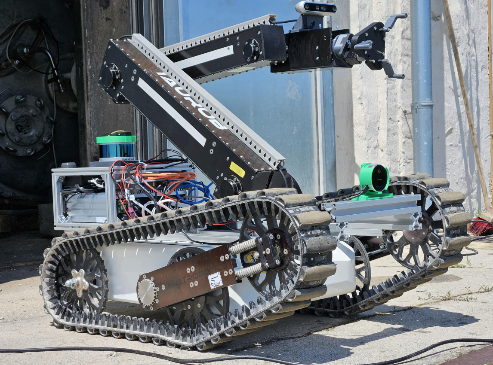

# Taurob Tracker arm control, gripper control and valve detection packages



<br>
<br>
A ROS-based system for autonomous valve detection and manipulation using the Taurob Tracker robot. The system utilizes YOLO for valve detection and MoveIt for motion planning and gripper control.

## Features

- Valve detection using YOLOv8
- Autonomous valve manipulation with MoveIt integration
- Custom gripper control for precise handling
- ROS-based architecture for modular functionality
- Visualization tools for system monitoring

## Recommended Prerequisites

- Ubuntu 20.04
- ROS Noetic
- Python 3.8+
- CUDA-compatible GPU (recommended)

## Installation

- Clone the repository:
```bash
git clone https://github.com/eliasbitsch/taurob_tracker.git
```

## System Architecture

The system consists of three main components:
- Valve Detection Node (YOLO-based)
- Motion Planning Node (MoveIt)
- Gripper Control Node


## License

This project is licensed under the MIT License - see the [LICENSE](LICENSE) file for details.